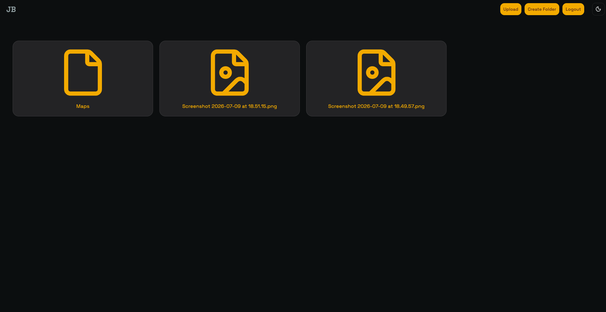
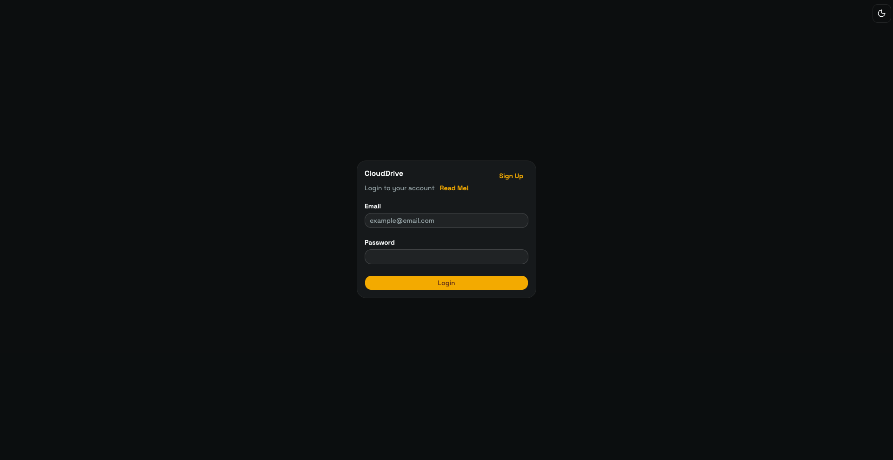
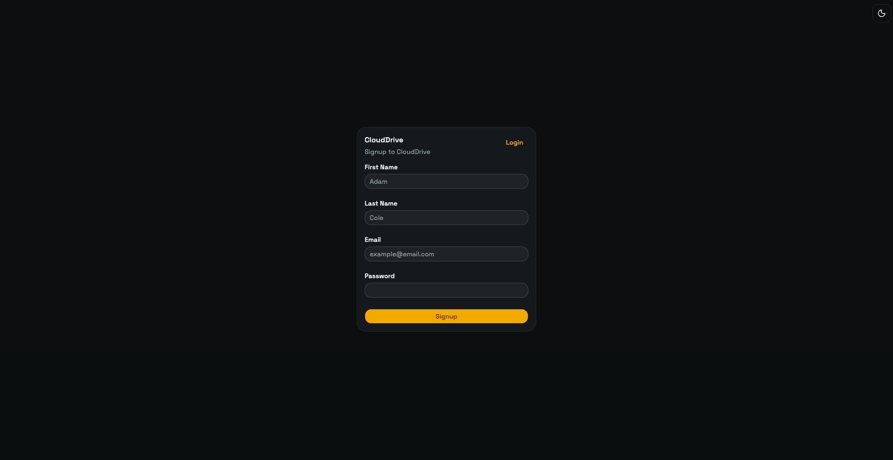
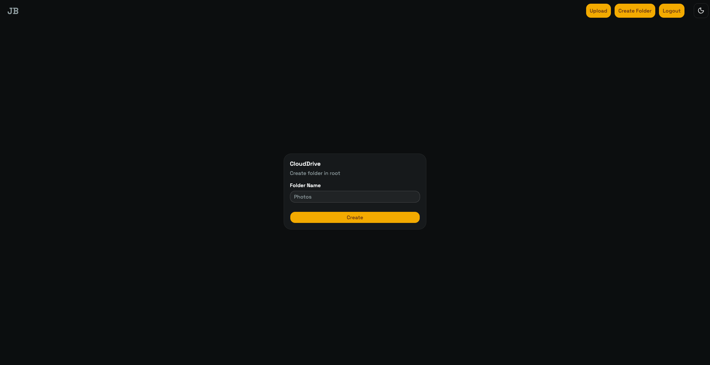
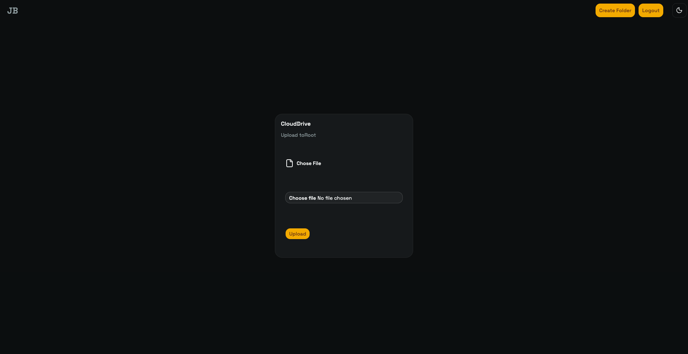
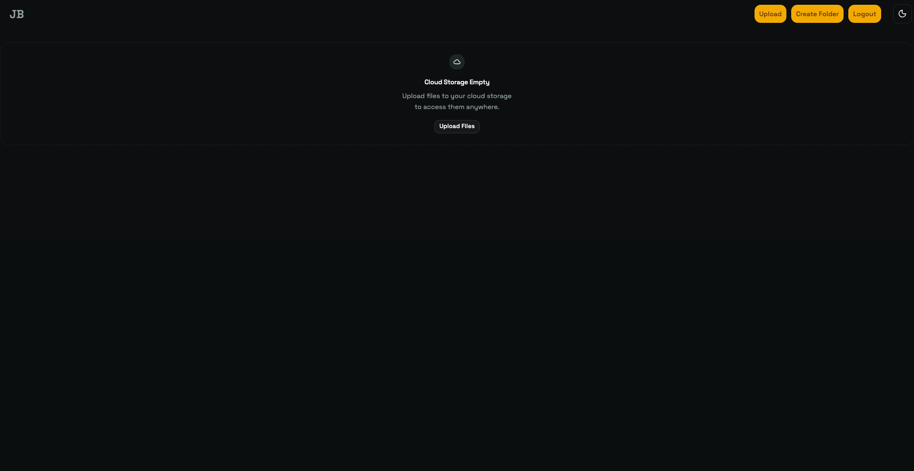

# Cloud Storage Odin


Cloud Storage Odin is a full-stack cloud storage app for managing personal files and folders in a browser. It supports account-based access, nested folders, file uploads, inline previews for supported media, and signed links for stored files.

## Live Demo

https://cloud-storage-odin-six.vercel.app



## Repository

https://github.com/aayusht200/cloudStorage-Odin

---

## Table of Contents

- [Features](#features)
- [Tech Stack](#tech-stack)
- [Project Structure](#project-structure)
- [Screenshots](#screenshots)
- [Getting Started](#getting-started)
- [Environment Variables](#environment-variables)
- [Deployment](#deployment)
- [Challenges](#challenges)
- [Future Improvements](#future-improvements)
- [License](#license)

---

## Features

- User registration, login, and logout
- Session-based authentication with Passport.js
- Protected frontend routes with React Router loaders
- Folder creation, deletion, and navigation
- Breadcrumb navigation
- File upload to S3-compatible object storage
- File preview for images, PDFs, audio, and video
- File metadata display
- Signed file URL copy/share action
- File deletion
- Download fallback for files without inline preview support
- Schema-driven form and request validation with Zod
- Light, dark, and system theme toggle
- Responsive drive grid and form layouts

## Tech Stack

| Area | Technologies |
| --- | --- |
| Frontend | React, TypeScript, Vite, React Router, React Hook Form, Tailwind CSS, Base UI, Axios, Zod |
| Backend | Node.js, Express, Passport.js, Express Session, Multer, Zod |
| Database | PostgreSQL, Prisma, `pg`, `connect-pg-simple` |
| Storage | AWS SDK for S3-compatible object storage |
| Tooling | ESLint, Prettier, Nodemon |

## Project Structure

```text
cloudStorage-Odin/
├── client/   # Vite React app, routes, loaders, UI components, contexts, and API services
└── server/   # Express API, controllers, routes, Prisma schema, auth, sessions, and storage logic
```

- `client/src/pages`: route-level screens for authentication, drive browsing, uploads, folder creation, loading, and errors.
- `client/src/components`: reusable UI elements used across the drive and auth flows.
- `client/src/service`: Axios API client and request helpers for auth, folders, files, upload, and deletion.
- `client/src/loaders`: React Router loaders for authentication redirects and drive/file data fetching.
- `client/src/schema`: Zod schemas and inferred payload types used for form validation and service contracts.
- `server/routes`: Express routers for user, folder, and file endpoints.
- `server/controller`: request handlers for authentication, folder operations, and file operations.
- `server/schema`: Zod schemas used by reusable validation middleware for request bodies, route parameters, and uploaded files.
- `server/middleware`: authentication middleware and reusable Zod request validation before controllers execute.
- `server/config`: database, session, Passport, Multer, and S3-compatible storage configuration.
- `server/service`: storage helpers for upload, deletion, signed URLs, and path generation.
- `server/prisma`: Prisma schema and migrations for users, folders, and files.

## Screenshots

### Login



### Signup



### Drive


### Folder Creation



### File Upload



### Empty Drive



## Getting Started

1. Clone the repository.

```bash
git clone git@github.com:aayusht200/cloudStorage-Odin.git
cd cloudStorage-Odin
```

2. Install frontend dependencies.

```bash
cd client
npm install
```

3. Install backend dependencies.

```bash
cd ../server
npm install
```

4. Configure environment variables.

Create `.env` files in `client/` and `server/` with the variables listed below.

5. Run the frontend.

```bash
cd client
npm run dev
```

6. Run the backend.

```bash
cd server
npm run dev
```

### Available Scripts

| Directory | Script | Purpose |
| --- | --- | --- |
| `client` | `npm run dev` | Start the Vite development server |
| `client` | `npm run build` | Build the production frontend |
| `client` | `npm run lint` | Run ESLint |
| `client` | `npm run preview` | Preview the production frontend build |
| `server` | `npm run dev` | Start the API with Nodemon |
| `server` | `npm start` | Start the API with Node |

> Note: the server includes an `npm test` placeholder that exits with an error; there is no configured test suite yet.

## Environment Variables

### Frontend

```text
VITE_API_URL
```

### Backend

```text
PORT
SESSION_SECRET
NODE_ENV
DATABASE_URL
S3_REGION
S3_ENDPOINT
S3_ACCESS_KEY_ID
S3_SECRET_ACCESS_KEY
S3_BUCKET_NAME
```

## Deployment

| Layer | Production Service |
| --- | --- |
| Frontend | Vercel |
| Backend | Render |
| Database | Supabase PostgreSQL |
| File storage | S3-compatible object storage |

The client includes `client/vercel.json` to route Vercel requests to `index.html` for client-side routing.
Incoming API payloads are validated with Zod middleware before reaching controllers.

## Challenges

- Maintaining session-based authentication across a separate frontend and backend.
- Persisting sessions in PostgreSQL while supporting production cookie settings.
- Modeling folders and files so users can navigate a nested folder hierarchy.
- Uploading files through the API and storing them in S3-compatible object storage.
- Generating signed URLs for file preview and copy/share actions.
- Using React Router loaders for route protection, redirects, and drive data fetching.
- Configuring credentialed CORS between local development and deployed Vercel frontend URLs.
- Supporting SPA routing on Vercel with an `index.html` rewrite.

## Future Improvements

- Multiple file upload
- Drag-and-drop uploads
- File and folder rename support
- Search across files and folders
- Dedicated download action for all file types
- Automated test coverage
- Improved empty states and loading states

## License

MIT
